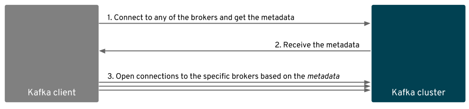
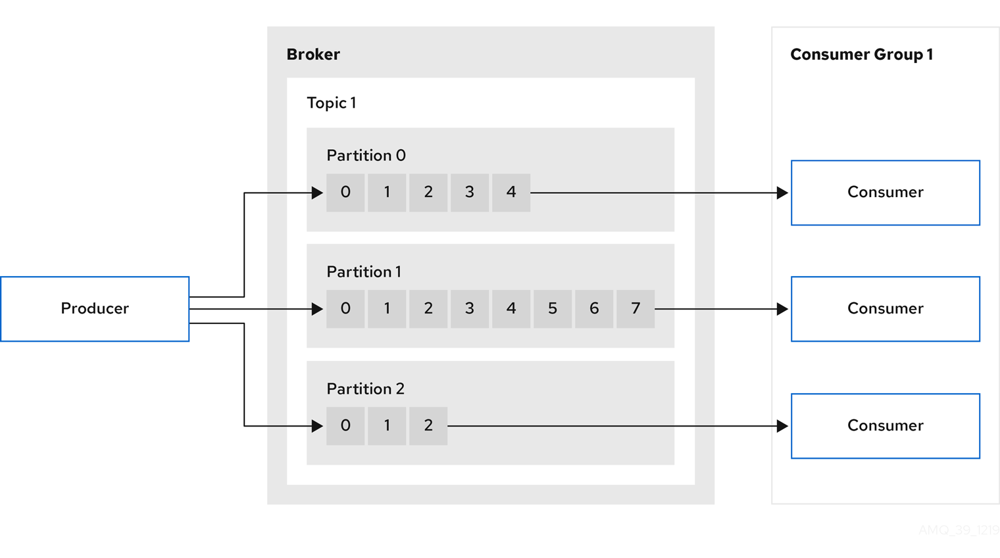

Planilla Usuario Lab OCP TLC

https://docs.google.com/spreadsheets/d/10xV2tuP6vIqj0saZTGqIkZ6p2Gbyr_CEQcDDcW_Of4c/edit#gid=0

---

# Requisitos

 - GIT command line
 - OC command line
 - CURL command line
 - OpenJDK 1.8 o superior
 - Graalvm 21.1.0 o superior
 - IDE for Java Developers (Eclipse/VisualCode/IntelliJ)
 - Docker 20 o superior
 - Descargar AMQ Streams 1.8 (https://access.redhat.com/jbossnetwork/restricted/softwareDownload.html?softwareId=101031)

## Acerca de AMQ Streams

AMQ Streams es una plataforma de transmisión de eventos distribuido basado en el proyecto de código abierto Apache Kafka para el procesamiento de datos en tiempo real, escalable y tolerantes a fallas.

- Te permite publicar y suscribirte a eventos.
- Te permite almacenar eventos todo el tiempo que quieras
- Te permite procesar y analizar eventos

## Eventos

Un evento es un mensaje que contiene una clave, un valor y una marca de tiempo. Un evento concreto podría ser una simple notificación sin información adicional, pero también podría incluir todos los detalles de lo que sucedió exactamente para facilitar el procesamiento posterior

### Formato de los eventos

Los brokers de Kafka, son independientes del formato de serialización o "tipo" de evento almacenado. Todo lo que ven es un par de bytes sin procesar para la clave del evento y el valor del evento `( <byte[], byte[]> en notación Java)`. Por lo tanto, los brokers no tienen idea de lo que contienen los datos que brindan; para ellos, es una caja negra.

Ejemplo de un mensaje
```yaml
MessageSet (Version: 1) => [offset message_size message]
offset => INT64
message_size => INT32
message => crc magic_byte attributes timestamp key value
    crc => INT32
    magic_byte => INT8
    attributes => INT8
        bit 0~2:
            0: no compression
            1: gzip
            2: snappy
            3: lz4
        bit 3: timestampType
            0: create time
            1: log append time
        bit 4~7: unused
    timestamp => INT64
    key => BYTES
    value => BYTES
```

### Topico y Particiones


Los topicos de Kafka están particionados, lo que significa que un topico se distribuye en diferentes brokers. Esta ubicación distribuida de sus datos es muy importante para la escalabilidad porque permite que las aplicaciones cliente lean los datos de muchos brokers al mismo tiempo.

Al crear un topico, debe elegir la cantidad de particiones que debe contener. Luego, cada partición contiene un subconjunto específico de los datos completos en un topico. Para hacer que sus datos sean tolerantes a fallas, cada partición se replicara incluso en centros de datos distintos, de modo que siempre haya varios brokers que tengan una copia de los datos en caso de una falla. 

Las particiones son el concepto más fundamental en Kafka, ya que su importancia va mucho más allá de la capa de almacenamiento: permiten la escalabilidad, elasticidad y tolerancia a fallas de Kafka en las capas de almacenamiento y procesamiento.

## Arquitectura del ecosistema de AMQ Stream


Kafka Cluster
> Un clúster de Kafka es un grupo de instancias de brokers.
> El broker es el encargado de organizar el almacenamiento y la transmisión de mensajes hacia los topicos. 
> Los topicos se dividen por particiones, donde se escriben los datos. 
> Las particiones se replican en todos los topicos para la tolerancia a fallos.
> El lider de particion maneja todas las solicitudes del productor para un topico.

Apache ZooKeeper
> Proporciona el servicio de coordinación del clúster, almacenando y rastreando el estado de los brokers y consumidores. También se utiliza para la elección de líderes de particiones.

Kafka Connect
> Kafka Connect proporciona un marco para integrar Kafka con una fuente o destino de datos externos, como una base de datos, para importar o exportar datos mediante conectores. 
> Los conectores son complementos que proporcionan la configuración de conexión necesaria. Es posible agregar tus propios conectores simplemente referenciando una imagen de una registry.

Clients (Consumer API / Producer API)
> Todo aquellos consumidores o productores de mensajes externos al cluster que utilizan las librerias para su integración.

Kafka Bridge
> Proporciona una API para integrar clientes basados en HTTP con el clúster de Kafka.

Kafka MirrorMaker
> Nos permite replicar los mensajes entre clústeres de Kafka.

## Kafka Cluster


## Instalación básica

Creamos el proyecto
```bash
oc new-project amq-streams
```

Después de instalar el operador, creamos un cluster de kafka con 3 brokers:
```yaml
apiVersion: kafka.strimzi.io/v1beta2
kind: Kafka
metadata:
  namespace: amq-streams
  name: my-cluster
spec:
  kafka:
    config:
      offsets.topic.replication.factor: 3
      transaction.state.log.replication.factor: 3
      transaction.state.log.min.isr: 2
      log.message.format.version: '2.8'
      inter.broker.protocol.version: '2.8'
    resources:
      limits:
        cpu: 1000m
        memory: 2000Mi
        ephemeral-storage: 5000Mi
      requests:
        cpu: 50m
        memory: 50Mi
        ephemeral-storage: 1000Mi
    version: 2.8.0
    storage:
      size: 1Gi
      type: persistent-claim
    replicas: 3
    listeners:
      - name: plain
        port: 9092
        type: internal
        tls: false
      - name: tls
        port: 9093
        type: route
        tls: true
  entityOperator:
    topicOperator: {}
    userOperator: {}
  zookeeper:
    resources:
      limits:
        cpu: 1000m
        memory: 1000Mi
        ephemeral-storage: 50Mi
      requests:
        cpu: 50m
        memory: 50Mi
        ephemeral-storage: 50Mi
    storage:
      size: 1Gi
      type: persistent-claim
    replicas: 3
```

> Si utiliza transacciones, el estado de las transacciones se almacenan en el topico interno `__transaction_state`. De forma predeterminada, los agentes están configurados con un factor de replicación de 3 y un mínimo de 2 réplicas sincronizadas para este tema, lo que significa que se requieren un mínimo de tres agentes en su clúster de Kafka.

Ejercicio 1
> - Crea un topico
> - Listar los topicos
> - Informacion del topico
> - Borrar un topico

Para empezar a gestionar el cluster, primero hay que descargar el certificado de la siguente manera:

Openshift login
```bash
oc login --token=sha256~xxxyyyzzz --server=https://api.talleramqstreams.d8ab.sandbox1168.opentlc.com:6443
```

Variables de entorno necesarias
```bash
BOOTSTRAP_SERVER_URL=$(oc get routes my-cluster-kafka-tls-bootstrap -n amq-streams -o=jsonpath='{.status.ingress[0].host}{"\n"}')
```

Obtenemos el certificado autofirmado del cluster
```bash
oc extract secret/my-cluster-cluster-ca-cert -n amq-streams --keys=ca.crt --to=- > ca.crt
```

Creamos el truststore.jks
```bash
keytool -keystore truststore.jks -alias CARoot -import -file ca.crt -keypass redhat01 -storepass redhat01
```

Creamos archivo de configuración del cliente
```bash
echo "
bootstrap.servers=${BOOTSTRAP_SERVER_URL}:443
security.protocol=SSL
ssl.truststore.location=$PWD/truststore.jks
ssl.truststore.password=redhat01
" > client.properties
```

Crear topic
```bash
bin/kafka-topics.sh --create --bootstrap-server ${BOOTSTRAP_SERVER_URL}:443 --command-config client.properties --replication-factor 3 --partitions 3 --topic my-topic
```

La configuracion de replicas y particiones se puede definir en forma global desde el operador con las siguentes propiedades

```yaml
      offsets.commit.required.acks: -1
      offsets.topic.num.partitions: 50
      offsets.topic.replication.factor: 3
```

Borrar topic
```bash
bin/kafka-topics.sh --bootstrap-server ${BOOTSTRAP_SERVER_URL}:443 --command-config client.properties --delete --topic my-topic
```

Listado de topics
```bash
bin/kafka-topics.sh --bootstrap-server ${BOOTSTRAP_SERVER_URL}:443 --command-config client.properties --list
```

Informacion del topic
```bash
bin/kafka-topics.sh --bootstrap-server ${BOOTSTRAP_SERVER_URL}:443 --command-config client.properties --describe --topic my-topic
```

## Producers y Consumers


Un Productor es un tipo de cliente de Kafka que se encarga de publicar los mensajes través de los brokers. Un consumidor por el contrario se encarga de consumir los mensajes. Un Grupo de consumidores es una agrupación de uno o más consumidores que trabajan para leer de un topic en base al cumplimiento de algún objetivo / funcionalidad concreta

Los productores determinan la partición a donde tiene que enviar los eventos, utilizando una función de partición `ƒ(event.key, event.value)` para decidir a qué partición de un topico se envía.

Para garantizar el orden de los eventos, los productores deben enviar eventos "relacionados" a la misma partición para que Kafka garantice el orden de los eventos solo dentro de una partición determinada de un topico, no entre particiones del mismo topico.

Los grupos se definen en los consumidores, cada miembre del grupo va estar procesando una o varias particiones.

### Protocolo de descubrimiento de Kafka

Kafka tiene su propio protocolo de descubrimiento. Cuando un cliente de Kafka se conecta al clúster de Kafka, primero se conecta a cualquier agente que sea miembro del clúster 
y le solicita metadatos para uno o más topico. Los metadatos contienen la información sobre los topico, sus particiones y los brokers que alojan estas particiones. 
Todos los brokers deben tener estos datos para todo el clúster porque todos están sincronizados a través de Zookeeper. 
Por lo tanto, no importa con qué broker se conectó el cliente en primer lugar, todos le darán la misma respuesta.



Una vez recibidos, el cliente utilizará los metadatos para averiguar dónde conectarse cuando quiera escribir o leer desde una partición determinada. 
Las direcciones de intermediario utilizadas en los metadatos serán creadas por el propio intermediario en función del nombre de host de la máquina donde se ejecuta el intermediario.


Ejercicio 2
 - Crea un producto y consumidor con la cli para intercambiar mensajes
 - Analizar las metricas del topic y consumer group
 
Creamos un productor 
```bash
bin/kafka-console-producer.sh --bootstrap-server ${BOOTSTRAP_SERVER_URL}:443 --producer.config client.properties --topic my-topic --property "parse.key=true" --property "key.separator=:"
```

- La propiedad `--property "parse.key=true"` establece que los mensajes entrantes tienen contenido la clave y el valor.
- La propiedad `--property "key.separator=:"` establece el separador para difernciar cuales es la clave y valor del mensaje.

```yaml
key1:value1
key2:value2
key3:value3
```

Creamos un consumidor
```bash
bin/kafka-console-consumer.sh --bootstrap-server ${BOOTSTRAP_SERVER_URL}:443 --consumer.config client.properties --topic my-topic --property print.key=true --property key.separator=":"
```

- La propiedad `--property print.key=true` permite visualizar las key de los mensajes
- La propiedad `--property key.separator=":"` permite diferenciar cual es el separador para el split

Veamos como se estan comportando nuestros clientes
```bash
bin/kafka-consumer-groups.sh --bootstrap-server ${BOOTSTRAP_SERVER_URL}:443 --command-config client.properties --all-groups --describe
```


Ejercicio 3
- Creamos 1 productor que nos permita setear la clave
- Creamos 2 consumidores con un mismo `consumer group` y clientId para diferenciarlo con la intencion de mostrar como se agrupan los mensajes a una misma particion cuando la clave es la misma



**Creamos un productores**

#1
```bash
bin/kafka-console-producer.sh --bootstrap-server ${BOOTSTRAP_SERVER_URL}:443 --producer.config client.properties --topic my-topic --property "parse.key=true" --property "key.separator=:"
```

Por defecto la estrategia de particionado utilizado es `kafka.producer.DefaultPartitioner`, es posible definir una nueva y referencianrla, cambiando la propiedad `partitioner.class` en el archivo `client.properties`

**Creamos los consumidores** (la misma cantidad de particiones)

#1
```bash
bin/kafka-console-consumer.sh --bootstrap-server ${BOOTSTRAP_SERVER_URL}:443 --consumer.config client.properties --topic my-topic --property print.key=true --property key.separator=":" --consumer-property client.id=client1 --consumer-property group.id=group1
```

#2
```bash
bin/kafka-console-consumer.sh --bootstrap-server ${BOOTSTRAP_SERVER_URL}:443 --consumer.config client.properties --topic my-topic --property print.key=true --property key.separator=":" --consumer-property client.id=client2 --consumer-property group.id=group1
```

#3
```bash
bin/kafka-console-consumer.sh --bootstrap-server ${BOOTSTRAP_SERVER_URL}:443 --consumer.config client.properties --topic my-topic --property print.key=true --property key.separator=":" --consumer-property client.id=client3 --consumer-property group.id=group1
```

- La propiedad `--consumer-property group.id=group1` define el groupID 
- La propiedad `--consumer-property client.id=client1` define un identificador para el cliente.

## Kafka Connect / Connector


### Kafka Connect 


Son los nodos workers donde se ejecutan los Kafka Connector, para esto lo primero que tenemos que hacer es crear un nodo de Kafka Connect de la siguente manera: 

```yaml
apiVersion: kafka.strimzi.io/v1beta2
kind: KafkaConnect
metadata:
  name: my-connect-cluster
  namespace: amq-streams
  annotations:
    strimzi.io/use-connector-resources: 'true'
spec:
  bootstrapServers: 'my-cluster-kafka-bootstrap:9092'
  version: 2.8.0
  replicas: 1
``` 

#### Rest Api

Kafka Connect nos proporciona una REST API que nos permite gestionar el ciclo de vida de nuestros connectors

Para visualizar cualeas son los plugins disponibles, dirigirnos al pod de Kafka Connect y ejecutamos:

```bash
curl http://my-connect-cluster-connect-api:8083/connector-plugins
```

Mas info en: https://docs.confluent.io/platform/current/connect/references/restapi.html


### Kafka Connector


Son los clientes que se desplegan en el cluster de Kafka Connect para procesar el flujo de datos, en esta oportunidad vamos a desplegar: 

Un cliente que consuma de un archivo y publique en un tipico

```yaml
apiVersion: kafka.strimzi.io/v1beta2
kind: KafkaConnector
metadata:
  name: my-source-connector
  labels:
    strimzi.io/cluster: my-connect-cluster
  namespace: amq-streams
spec:
  class: org.apache.kafka.connect.file.FileStreamSourceConnector
  config:
    file: /tmp/file.in
    topic: my-topic
  tasksMax: 1
```

Y otro cliente que consuma de un topico y registre en un archivo

```yaml
apiVersion: kafka.strimzi.io/v1beta2
kind: KafkaConnector
metadata:
  name: my-sink-connector
  labels:
    strimzi.io/cluster: my-connect-cluster
  namespace: amq-streams
spec:
  class: org.apache.kafka.connect.file.FileStreamSinkConnector
  config:
    file: /tmp/file.out
    topics: my-topic
  tasksMax: 1
```

#### Plugins

Alternativa 1: 

Fuera de openshift, para agregar mas plugins, es necesario modificar el archivo `$KAFKA_HOME/config/connect-standalone.properties` dentro del cluster de Kafka Connect y configurar la propiedad `plugin.path` con la ubicacion de los jars:

```yaml
plugin.path=/home/kafka/connectors
```

Alternativa 2:

Con el operador, hay que especificar la URL donde se encuentra el plugin:

```bash
apiVersion: kafka.strimzi.io/v1beta2
kind: KafkaConnect
metadata:
  name: my-connect-cluster
  annotations:
    strimzi.io/use-connector-resources: "true"
spec:
  replicas: 1
  bootstrapServers: my-cluster-kafka-bootstrap:9092
  build:
    output:
      type: docker
      image: my-reg.io/my-org/my-connect-cluster:latest
      pushSecret: my-registry-credentials
    plugins: 
      - name: camel-timer
        artifacts:
          - type: tgz
            url: https://repo.maven.apache.org/maven2/org/apache/camel/kafkaconnector/camel-timer-kafka-connector/0.8.0/camel-timer-kafka-connector-0.8.0-package.tar.gz
            sha512sum: c0102700ae176b1ef078bdb86d640935a1333865e58b870f6b0ef3d9dad067221122aee6bf52852dad209a7c2051f359e0434fc7fbd783fb50e21707c7577ef9
  template:
    pod:
      imagePullSecrets:
        - name: my-registry-credentials
```

Alternativa 3:

La ultima alternativa hacer un s2i de un repositorio con las plugins ya cagados. 

## Kafka Bridge


Para la instalación nos dirigimos al operador y oprimimos sobre el botón "Create Kafka Bridge", definimos un nombre y el host:port del kafka boostrap:

Yaml resultante:
```yaml
apiVersion: kafka.strimzi.io/v1beta2
kind: KafkaBridge
spec:
  bootstrapServers: 'my-cluster-kafka-bootstrap:9092'
  http:
    port: 8080
  replicas: 1
```

Variables de entorno necesarias
```bash
KAFKA_BRIDGE_ROUTE_URL=$(oc get routes bridge -n amq-streams -o=jsonpath='{.status.ingress[0].host}{"\n"}')
```

Verificamos que el servicio este disponible
```bash
curl -v GET "http://${KAFKA_BRIDGE_ROUTE_URL}:80/healthy"
```

Producimos un mensaje:
```bash
curl -X POST \
  "http://${KAFKA_BRIDGE_ROUTE_URL}:80/topics/my-topic" \
  -H 'content-type: application/vnd.kafka.json.v2+json' \
  -d '{
    "records": [
        {
            "key": "key-1",
            "value": "value-1"
        },
        {
            "key": "key-2",
            "value": "value-2"
        }
    ]
}'
```

Consumimos un mensaje, para esto necesitamos primero registar el consumidor:

```bash
curl -X POST "http://${KAFKA_BRIDGE_ROUTE_URL}:80/consumers/my-group" \
  -H 'content-type: application/vnd.kafka.v2+json' \
  -d '{
    "name": "my-consumer",
    "format": "json",
    "auto.offset.reset": "earliest",
    "enable.auto.commit": false
  }'
```

Como resultado nos devuelve un endpoint desde donde tenemos que empezar a consumir
```bash
{"instance_id":"my-consumer","base_uri":"http://bridge-amq-streams.apps.tallerkafka.e07b.sandbox647.opentlc.com:80/consumers/my-group/instances/my-consumer"}%
```

Nos subcribimos al topic
```bash
curl -X POST "http://${KAFKA_BRIDGE_ROUTE_URL}:80/consumers/my-group/instances/my-consumer/subscription" \
  -H 'content-type: application/vnd.kafka.v2+json' \
  -d '{
    "topics": [
        "my-topic"
    ]
}'
```

Consumimos los mensajes
```bash
curl -X GET "http://${KAFKA_BRIDGE_ROUTE_URL}:80/consumers/my-group/instances/my-consumer/records" -H 'accept: application/vnd.kafka.json.v2+json'
```


# Kafka Streams

https://developers.redhat.com/blog/2020/09/28/build-a-data-streaming-pipeline-using-kafka-streams-and-quarkus#summary

## Run broker
```sh
cd /Users/damianlezcano/rh/kafka_2.13-2.8.0
bin/zookeeper-server-start.sh config/zookeeper.properties
bin/kafka-server-start.sh config/server.properties
```

## Crear Topic

```bash
bin/kafka-topics.sh --create --bootstrap-server localhost:9092 --replication-factor 1 --partitions 1 --topic left-stream-topic
bin/kafka-topics.sh --create --bootstrap-server localhost:9092 --replication-factor 1 --partitions 1 --topic right-stream-topic
bin/kafka-topics.sh --create --bootstrap-server localhost:9092 --replication-factor 1 --partitions 1 --topic stream-stream-outerjoin
bin/kafka-topics.sh --create --bootstrap-server localhost:9092 --replication-factor 1 --partitions 1 --topic processed-topic
```

```bash
cd data-streaming-kafka-quarkus/quarkus-kafka-streaming
./mvnw compile quarkus:dev
curl localhost:8080/startstream
```

```bash
bin/kafka-console-producer.sh --bootstrap-server localhost:9092 --topic left-stream-topic --property "parse.key=true" --property "key.separator=:"
bin/kafka-console-producer.sh --bootstrap-server localhost:9092 --topic right-stream-topic --property "parse.key=true" --property "key.separator=:"

bin/kafka-console-consumer.sh --bootstrap-server localhost:9092 --topic stream-stream-outerjoin --property print.key=true --property key.separator=":"

bin/kafka-topics.sh --bootstrap-server localhost:9092 --list
```

# Metricas

```yaml
apiVersion: kafka.strimzi.io/v1beta2
kind: Kafka
metadata:
  namespace: amq-streams
  name: my-cluster
spec:
  kafkaExporter:
    groupRegex: .*
    topicRegex: .*
```

## TLS

Create la clave y el certificado (desarrollo)

```bash
openssl req -x509 -newkey rsa:4096 -keyout kafka.key -out kafka.pem -days 365 -nodes

Country Name (2 letter code) []:AR
State or Province Name (full name) []:BSAS
Locality Name (eg, city) []:CABA
Organization Name (eg, company) []:*.apps.talleramqstreams.2aa5.sandbox247.opentlc.com
Organizational Unit Name (eg, section) []:*.apps.talleramqstreams.2aa5.sandbox247.opentlc.com
Common Name (eg, fully qualified host name) []:*.apps.talleramqstreams.2aa5.sandbox247.opentlc.com
Email Address []:user@redlink.com
```

Secret con el certificado

```bash
oc create secret generic kafka-cert-secret -n amq-streams --from-file=kafka-listener-certificate.crt=kafka.pem --from-file=kafka-listener-key.key=kafka.key
```

Referenciamos el certificado
```yaml
      - name: external
        port: 9094
        type: route
        tls: true
        configuration:
          brokerCertChainAndKey:
            secretName: kafka-cert-secret
            certificate: kafka-listener-certificate.crt
            key: kafka-listener-key.key
```

### Verificamos

Obtenemos la nueva ruta
```
BOOTSTRAP_SERVER_CUSTOMTLS_URL=$(oc get routes my-cluster-kafka-bootstrap -n amq-streams -o=jsonpath='{.status.ingress[0].host}{"\n"}')
```

Verificamos el certificado con OpenSSL
```bash
openssl s_client -showcerts -servername ${BOOTSTRAP_SERVER_CUSTOMTLS_URL} -connect ${BOOTSTRAP_SERVER_CUSTOMTLS_URL}:443
```

Obtenemos el certificado publico y generamos nuestro keystore.jks
```bash
echo -n | openssl s_client -connect ${BOOTSTRAP_SERVER_CUSTOMTLS_URL}:443 -servername ${BOOTSTRAP_SERVER_CUSTOMTLS_URL} -showcerts | sed -ne '/-BEGIN CERTIFICATE-/,/-END CERTIFICATE-/p' > kafka-ocp-route.pem

keytool -import -file kafka-ocp-route.pem -alias kafka -keystore truststore.jks
```

Creamos archivo de configuración del cliente
```bash
echo "
bootstrap.servers=${BOOTSTRAP_SERVER_CUSTOMTLS_URL}:443
security.protocol=SSL
ssl.truststore.location=$PWD/truststore.jks
ssl.truststore.password=redhat01
" > client.properties
```

Crear topic
```bash
bin/kafka-topics.sh --bootstrap-server ${BOOTSTRAP_SERVER_CUSTOMTLS_URL}:443 --command-config client.properties --list
```

## Performance Test

Creamos el topico
```bash
bin/kafka-topics.sh \
--create \
--topic topic-perf-test \
--partitions 3 \
--replication-factor 3 \
--config min.insync.replicas=2 \
--bootstrap-server ${BOOTSTRAP_SERVER_CUSTOMTLS_URL}:443 \
--command-config client.properties
```

Producer Performance Test
```bash
bin/kafka-producer-perf-test.sh \
--topic topic-perf-test \
--throughput -1 \
--num-records 3000 \
--record-size 1024 \
--producer-props acks=all bootstrap.servers=${BOOTSTRAP_SERVER_CUSTOMTLS_URL}:443 \
--producer.config client.properties \
--print-metrics
```

Es posible tambien definir un mensaje a travez de un archivo:
```bash
--payload-delimiter DELIMITER 
--payload-file INPUT_FILE
```

Consumer Performance Test
```bash
bin/kafka-consumer-perf-test.sh \
--topic topic-perf-test \
--broker-list ${BOOTSTRAP_SERVER_CUSTOMTLS_URL}:443 \
--messages 3000 \
--consumer.config client.properties \
--timeout 200000 \
--group consumer-perf-test-group
```

Otras configuraciones destacadas
```bash
--group gid: If you run more than one instance of this test, you will want to set different ids for each instance.
--num-fetch-threads: Defaults to 1. Increase if higher throughput testing is needed.
--from-latest: To start consuming from the latest offset. May be needed for certain types of testing.
```


bin/kafka-topics.sh --bootstrap-server ${BOOTSTRAP_SERVER_CUSTOMTLS_URL}:443 --command-config client.properties --delete --topic topic-perf-test

bin/kafka-consumer-groups.sh --bootstrap-server ${BOOTSTRAP_SERVER_CUSTOMTLS_URL}:443 --command-config client.properties --all-groups --describe

